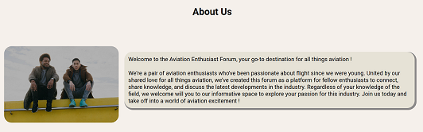

#  👋 Hello There, I'm Muhammad Rifqi Saleh


I'M A BEGINNER IN SOFTWARE DEVELOPING. WELCOME TO MY GITHUB PROFILE! 🚀✈️

[](https://instagram.com/rifqisaleh) [](https://www.linkedin.com/in/muhammad-rifqi-saleh-77b61911a/) 

<br/>


## <i><b>About This Project</b></i>
Hello everyone ! <br/> <br/>
As part of my software engineering course, i was tasked to make a simple website based of HTML and design it with CSS. This website consist of sticky Navbar, log in & sign up form, Introduction paragraph and gallery preview. This website are made for showcasing airplane photos and as a forum for discussion.

Visit this link (https://rifqisaleh.github.io/assignment1-rifqisaleh/) to access the website !

## <i><b> Table of Contents </b></i>
<ul><li>Technologies Used</li>
<li>Features</li>
<li>Setup</li>
<li>Sections</li> 
<li>Notes</li></ul>


<br/>

## <i><b> Technologies used </b></i>

`HTML 5` `CSS`

<br/>

## <i><b> Features </b></i> <br/>

<ul>
<li>Screen design that cater to all devices</li>
<li>Simple navigation bar</li>
<li>Introductory paragraph & sign in</li>
<li>Preview section for showcasing photo</li>
<li>Sign Up section</li> </ul>

<br/>

## <i><b>Setup</b></i> <br/>

1. Through your preferred terminal, clone the repository:<br>
    `git https://github.com/revou-fsse-oct24/module-1-rifqisaleh.git`

2. Navigate to the project directory:<br>
`cd module-1-rifqisaleh`

3. Open the `index.html` file in your browser:
   
4. For accessing any pictures from "images" folder, you can use: <br>
 `

 ## <i><b>Sections</i></b>

 <ul><li><b>Simple Sticky Navbar</b><br>
Navbar consist of Home, Forum and About Us. Home and About Us are linked with 'index.html' and 'profile.html' respectively by using:<br><br>

 ```{r, eval=FALSE}
 <a href="index.html">Home</a>
```
```{r, eval=FALSE}
<a href="profile.html">AboutUs</a>
```
The navbar are also available in 'profile.html' or About Us page file to improve accesibility. Using CSS i add 'position: sticky;' on the container to allow the navbar to follow the scrolling pattern (up and down). Furthermore, i added media query to cater to different screen size
```{r, eval=FALSE}
/*navbar*/
.container {
  background-color: rgb(182, 200, 207);
  font-size: 1.2rem;
  font-family: sans-serif;
  height: 50px;
}

@media screen and (min-width: 390px) and (max-width: 767px) {
  .container{
    height: 100%
  }
  .container .navbar {
    flex-direction: column;
  }
}

header {
    position: sticky;
    top: 0;
    z-index: 1;
   }
   ```
 
 </li><br/><br>

<li><b>Introduction Paragraph and Sign in</b><br>
A short introduction paragraph and a login form are located as part of the main content of the page.<br><br>

<br> <br>This section are design to cater screen size change by using media query and by changing the direction of the flexbox to column in certain parametes. <br> <br>

```{r, eval=false}
 /*content*/
.content {
  display: flex;
justify-content: center;
 }

 @media only screen and (max-width:768px) {
  .content {
    display: flex;
  flex-direction: column;
}
}
```
<br><br><br>

<li><b>Preview Gallery</b><br>
This section provide a glimpse of what user can expect if they decided to join the website. Just like the previous section, the flexbox within the gallery preview are designed to change direction to column during screen changes. <br> <br>
<br><br><br>

<li><b>Sign Up</b><br>
As for new user, a sign up form for new users to register is provided on bottom section of the page.
<br><br>
<br><br><br>


## <i><b> Notes </b></i> <br>
Throughout the HTML and CSS files, i have sectioned each content for easy accesibility during future development.<br><br>
Example:<br>

```{r, eval=False}
 <section class="sign in">
            <ul>
          <form action="/action.php" methods="post">
            <p><i><b>Sign In</b></i></p>
            <label for="Email">Email</label> <br/> <input type="email" name="email" placeholder="Insert Email" id="Email"> <br/> <br/> 
            <label for="Password">Password</label> <br/> <input type="password"  name="password" placeholder="Password" id="Password"> <br/> <br/>
            <input type="Submit" value="submit" id="">
          </form> </section>
```

```{r, eval=false}
/*logo*/
  .logo {
    position: relative;
  text-align: center;
  color: white
  }
```  