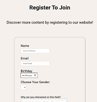

#  👋 Hello There, I'm Muhammad Rifqi Saleh


I'M A BEGINNER IN SOFTWARE DEVELOPING. WELCOME TO MY GITHUB PROFILE! 🚀✈️

[](https://instagram.com/rifqisaleh) [](https://www.linkedin.com/in/muhammad-rifqi-saleh-77b61911a/) 

<br/>


## <i><b>About This Project</b></i>
Hello everyone ! <br/> <br/>
As part of my software engineering course, i was tasked to make a simple website based of HTML and design it with CSS. This website consist of sticky Navbar, log in & sign up form, Introduction paragraph and gallery preview. This website are made for showcasing airplane photos and as a forum for discussion.

Visit this link (https://aviationforum.site/) to access my deployment !

## <i><b> Table of Contents </b></i>
<ul><li>Technologies Used</li>
<li>Features</li>
<li>Setup</li>
<li>Sections</li> 
<li>Notes</li>
<li>Deployment</li></ul>


<br/>

## <i><b> Technologies used </b></i>

`HTML 5` `CSS`

<br/>

## <i><b> Features </b></i> <br/>

<ul>
<li>Screen design that cater to all devices</li>
<li>Simple navigation bar</li>
<li>Introductory paragraph </li>
<li>Preview section for showcasing photo</li>
<li>Sign Up section</li> </ul>

<br/>

## <i><b>Setup</b></i> <br/>

1. Through your preferred terminal, clone the repository:<br>
    `git https://github.com/revou-fsse-oct24/module-1-rifqisaleh.git`

2. Navigate to the project directory:<br>
`cd module-1-rifqisaleh`

3. Open the `index.html` file in your browser:
   
4. For accessing any pictures from "images" folder, you can use: <br>
 `

 ## <i><b>Sections</i></b>

 <ul><li><b>Simple Sticky Navbar</b><br>
Navbar consist of Home, Forum and About Us. Home and About Us are linked with 'index.html' and 'profile.html' respectively by using:<br><br>

 ```{r, eval=FALSE}
 <a href="index.html">Home</a>
```
```{r, eval=FALSE}
<a href="profile.html">AboutUs</a>
```
The navbar are also available in 'profile.html' or About Us page file to improve accesibility. Using CSS i add 'position: sticky;' on the container to allow the navbar to follow the scrolling pattern (up and down). Furthermore, i added media query to cater to different screen size
```{r, eval=FALSE}
/*navbar*/
.container {
  background-color: rgb(182, 200, 207);
  font-size: 1.2rem;
  font-family: sans-serif;
  height: 50px;
}

@media screen and (min-width: 390px) and (max-width: 767px) {
  .container{
    height: 100%
  }
  .container .navbar {
    flex-direction: column;
  }
}

header {
    position: sticky;
    top: 0;
    z-index: 1;
   }
   ```
 
 </li><br/><br>

<li><b>Introduction Paragraph</b><br>
A short introduction paragraph and a login form are located as part of the main content of the page.<br><br>

<br> <br>This section are design to cater screen size change by using media query and by changing the direction of the flexbox to column in certain parametes. <br> <br>

```{r, eval=false}
 /*content*/
.content {
  display: flex;
justify-content: center;
 }

 @media only screen and (max-width:768px) {
  .content {
    display: flex;
  flex-direction: column;
}
}
```
<br><br><br>

<li><b>Preview Gallery</b><br>
This section provide a glimpse of what user can expect if they decided to join the website. Just like the previous section, the flexbox within the gallery preview are designed to change direction to column during screen changes. <br> <br>
<br><br><br>

Moreover, transitions are added to the section to restore color when user hover their cursor on the photos.

```{r, eval=false}
.gallery__img {
  width: 100%;
  height: 100%;
  object-fit: cover;
  display: block; 
  filter:grayscale(100%);
  transition: all .23s ease-in-out;
}

.gallery__img:hover {
  filter:grayscale(0%);
}
```


<li><b>Sign Up</b><br>
As for new user, a sign up form for new users to register is provided on bottom section of the page.
<br><br>
<br><br><br>


## <i><b> Notes </b></i> <br>
Throughout the HTML and CSS files, i have sectioned each content for easy accesibility during future development.<br><br>
Example:<br>

```{r, eval=False}
 <section class="sign in">
            <ul>
          <form action="/action.php" methods="post">
            <p><i><b>Sign In</b></i></p>
            <label for="Email">Email</label> <br/> <input type="email" name="email" placeholder="Insert Email" id="Email"> <br/> <br/> 
            <label for="Password">Password</label> <br/> <input type="password"  name="password" placeholder="Password" id="Password"> <br/> <br/>
            <input type="Submit" value="submit" id="">
          </form> </section>
```

```{r, eval=false}
/*logo*/
  .logo {
    position: relative;
  text-align: center;
  color: white
  }
```  
<br>
<br>

## <i><b> Deployment </b></i> <br>
In this section, i will explain my website deployment process. This sections are divided into 5 sections. Which includes:
1. Website/Tools Used
2. Register
3. Deployment
4. Domain Registration
5. Version Update Test by Git

<br>
<li><b>Website/Tools Used</b><br>
The tools/website that are used for this deployment are:
<ul>

[My Github Repo](https://github.com/rifqisaleh/assignment1-rifqisaleh)<br>
[Netifly](https://www.netlify.com/) <br>
[Niagahoster](https://www.niagahoster.co.id/)

</ul>


<br>
<li><b>Register</b><br>
I deployed my website through netifly. At first, i struggled to register to the site with every sign-in attempt lead to "authorization error". I then managed to get into my account by following an advice from

[Stock Overflow](https://stackoverflow.com/questions/70109590/we-already-have-a-registered-user-with-this-email-address-log-in-to-connect-you).

<br>
*Netifly User Home Page*


<br>
<li><b>Deployment</b><br>
<br>

- After signing in, i proceed to import my existing repository by clicking the "Import From Git" on my main netifly page.

- It will then lead to a page where i can choose to export my project from different git provider. In this case, i'll be using Repo from github. It will prompt to select a specific repo to deploy. 
<br/> 

- I chose "aviationforum" as my site name. It will then check my preferred name availability. Within the same page, i then proceeds to deploy my project by clicking `Deploy aviationforum`.
<br/> 

- It will then revert back to site overview, where i can observe the deployment progress. When the deployment are done, a success message popped up. 
<br/>

<li><b>Domain Registration</b></li><br/>

- For this deployment, i will be using a local domain hosting, niagahoster.

- After log-in, i clicked `Miliki Domain Baru`, add my preferred site name and then purchase the preferred domain. Next, i set the site configuration and personal contact information. <br/> 

- If successful,the page then redirected to `Ringkasan Domain`, and then i need to configure the DNS name. <br/> 

- To set up the DNS name, i went back to netifly and on the Site Overview page, i chose `Set Up a Custom Domain`. I then add and verify my preferred site name (aviationforum.site). Afterwards, i proceeds to `Add Domain`.

- The page then redirected to Domain Management, and just to the right of "aviationforum.site", i click `option` and `Go To DNS Panel`. <br/> 

- I then copy the four domain's name server, and paste it on niagahoster name server. After saving the DNS name, I waited at least 30 minutes before i can finally access my website.

<br/>
<li><b>Version Update Test by Git</b></li><br/>
In this section, i will demonstrate a mock fix of my repo by using git.

- First, on my terminal i make a new branch under the name of feature/bugfix by using:<br/>
`git checkout -b feature/bugfix`

- I corrected a grammar mistake in line 58, proceeds to add the revised code and commit the changes with an appropriate message regarding the changes. <br/>
`git add index.html`
`git commit -m"Adding Plural on line 58"`

- I then proceed to push the changes by using:<br/>
`git push origin feature/bugfix`

- On my repo, i then navigate toward `Pull Request` and the changes i made are now visible. I then add description and proceeds to create pull request. The system will then review whether there'll be any conflict within my code. As there are no conflict, i then proceeds with merging the pull request.

- With the help of CI/CD, the changes i made automatically updated my current active site.
<br/> <br/>
*Netifly merging the updated code*<br/> <br/> <br/>
 <br/>
 *Before*<br/> <br/> <br/>
  <br/>
 *After*
